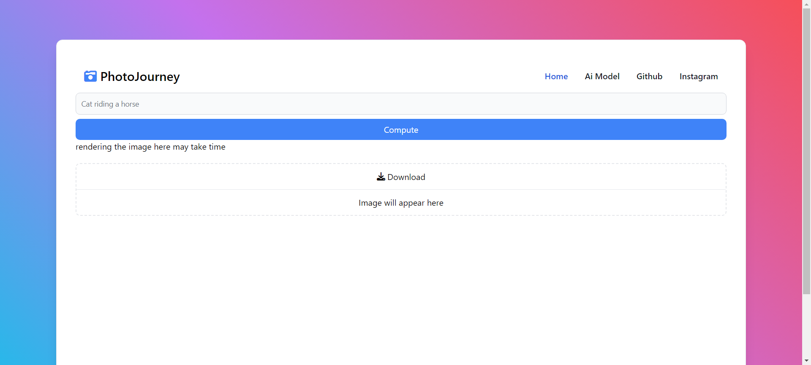
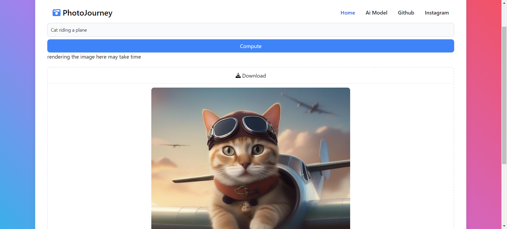
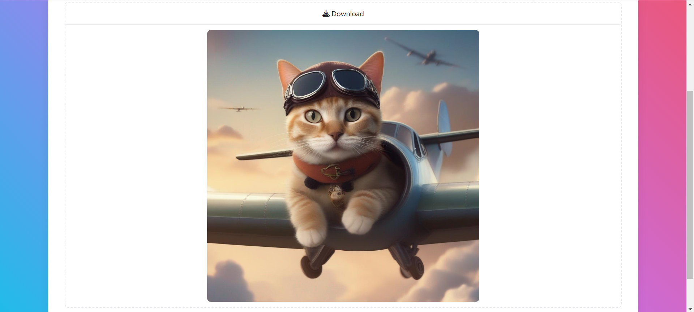

# PhotoJourney

An open source web application built using React, Tailwind CSS, Flowbite, HuggingFace

It just a simple project I didn't focused to cool ui, auth feature etc

It is just like lite version of midjourney, DALL-E

# Prompt and Its Generated Images

Prompt: Cat


<hr/>

Prompt: A girl studying medicine


<hr />
Prompt: Japanese city with aliens in sky


# Application Screenshots







# Running Locally

1. Clone this repository

```bash
$ git clone https://github.com/Cat-The-Developer/text-to-image-webAI.git
```

2. Go to folder

```bash
$ cd text-to-image-webAI
```

3. Install dependencies

```bash
$ yarn
```

4. create a .env file

```bash
$ touch .env
```

5. add your hugging face api key

```
VITE_AI_MODEL="your api key comes here"
```

6. Run the application

```bash
$ yarn dev
```
